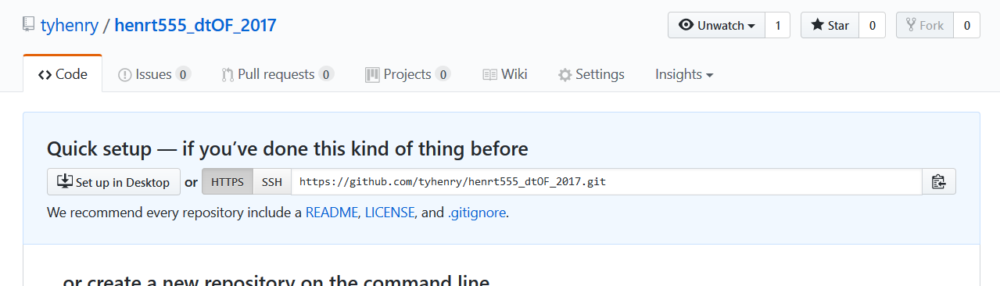

# Setup


## 1. Download openFrameworks

Go to [openFrameworks.cc/download](http://openframeworks.cc/download/) and download the OF version that matches your platform (Mac, Windows, or Linux).

Unzip this file. You'll see a folder like `of_v0.9.8_osx_release`, which contains everything you need to use openFrameworks. 

I recommend placing OF on your Desktop so it's easily accessible, i.e. `~/Desktop/of_v0.9.8_osx_release`.  You can also rename the folder to something nicer like `~/Desktop/openFrameworks` if you want.


## 2. Setup your IDE

Your IDE - "integrated development environment" - is where you will write and build your openFrameworks applications.

#### macOS:
Use **Xcode** as your IDE.  
[Follow these instructions](http://openframeworks.cc/setup/xcode/) on the openFrameworks website to get set up with Xcode.  
_Note:_ Xcode (v8.3) requires macOS Sierra (10.12), so you will need to upgrade your OS if you don't have Sierra.

#### Windows:
You'll use **Visual Studio Community 2015**.  [Follow these instructions](http://openframeworks.cc/setup/vs/) to get set up.


## 3. Install Git

Git is the "version control" software we will use to keep track of our code, and share it with each other.  
We will be use Git on the command line (i.e. through Terminal on a Mac).

Here's how to install Git:

#### macOS:

On Mac, you'll want to install the [Homebrew](http://brew.sh/) package manager first, which will allow you to easily keep Git up to date.

1. **install Homebrew**  
    Follow the instruction at the [Homebrew website](https://brew.sh/) to install

2. **then install Git**
	In Terminal type `brew install git`

#### Windows:

Download the installer from [the Git website](https://git-scm.com/download/win).  This will install Git, as well as __Git Bash__, which you will use as your command line interface to control Git.


## 4. Clone this repository

Open the command line (__Terminal__ on Mac, or __Git Bash__ on Windows), and navigate to your openFrameworks root directory. For instance, type:

	cd ~/Desktop/openFrameworks
	
(or replace `~/Desktop/openFrameworks/` with your openFrameworks folder path).

Now clone this repository:

	git clone https://github.com/tyhenry/dt_openframeworks_2017.git

You will see that the folder appears next to the `apps/`, `libs/` and `addons/` folders, i.e.

* ```addons/```
* ```apps/```
* ```libs/```
* ```examples/```
* ```scripts/```
* ```dt_openframeworks_2017/```

This folder structure will allow you to build the example applications from the `dt_openframeworks_2017` repo.


## 5. Create a GitHub account, and make a new repository for your homework

GitHub is the most popular website for hosting code.  
Git + GitHub is the system we'll use to share example code, and how you'll submit homework.

1. **Sign up:** 
   You need to [sign up for a free account at GitHub.com](https://github.com/join) if you don't have one already.

2. **Create repo:** 
   Now create a repository for your homework on GitHub.com.  
   To create a new repo, click the **+** symbol in the upper right of the page.  
   **NAME IT AS FOLLOWS:** `[NewSchoolID]_dtOF_2017` (for example: `henrt555_dtOF_2017`)

3. **Clone your new repo to your computer:**  
  - Copy the repo address given to you by GitHub (e.g. `https://github.com/tyhenry/henrt555_dtOF_2017.git`) 

     

  - In Terminal (or Git Bash on Windows) navigate to your `openFrameworks/apps/` folder (e.g. type `cd ~/Desktop/openFrameworks/apps/`) 

  - Now type `git clone ` and paste the address (e.g. `git clone https://github.com/tyhenry/henrt555_dtOF_2017.git`)

  Now your homework repo folder should be setup inside `openFrameworks/apps/`. 
  Here is where you will create your openFrameworks homework sketches using OF Project Generator. 
  You must organize your sketches by naming them as follows: ```[WEEK_NUMBER]_[HOMEWORK_NUMBER]_[NAME]```. 

  For example:

```
	openFrameworks/
		addons/
		app/
			henrt555_dtOF_2017/
				w01_h01_helloworld/
				w01_h02_blahblah/
				w02_h01_gototen/ 
				w03_h01_nandnor/ 
				etc…/
				…/
		libs/
		examples/
		dt_openframeworks_2017/
```


4. **Add .gitignore file**
  To keep your GitHub repo nice and neat, you need to add a `.gitignore` file that tells Git what file types you __don't__ want to track and send to GitHub. 
  Copy the [.gitignore](../.gitignore) file from the `dt_openframeworks_2017` repo folder to your homework folder. 

  In Mac Finder or Windows Explorer you need to enable the **show hidden files** setting. 

  Or you can use the command line:  

```shell
cd ~/Desktop/openFrameworks/apps/henrt555_dtOF_2017 
cp ../../dt_openframeworks_2017/.gitignore .
```

