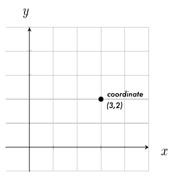

# Week 3 

## Code Examples

* **BouncingBall** adding acceleration (gravity) to the old Bouncing Ball example
* **Zeno** illustration of interpolation and "Zeno" easing technique
* **MultiZeno** using ofMap to create a multicolor worm that follows the mouse

## Review

### Vectors - ofVec2f

In math, a vector is a position in 2D (or 3D, 4D...) coordinates.  
In openFrameworks, we use the class __ofVec2f__ to describe a 2D vector.

You can think of a vector as a position in space -  
**or** as an arrow pointing from the origin _(0,0)_ to that position _(x,y)_.  
This arrow represents a _direction_ (angle of arrow) and a _magnitude_ (length of arrow).



We can do lots of useful things with vectors, like adding, subtracting and multiplying (scaling) them:

```c++
ofVec2f addVec = ofVec2f(3,2) + ofVec2f(1,1); // == ofVec2f(4,3)

ofVec2f scaleVec = ofVec2f(3,2) * 2.; // == ofVec2f(6,4)
```

In class, we'll use `ofVec2f` to represent both positions and movement in space.


### Interpolation

Interpolation is a like a smooth transition from one value to another.   
It's a very handy concept for creating animations.

We can use interpolation to smoothly move things, scale things, change colors, etc.

The magic basic interpolation formula is:  

`C = A * (1-percent) + B * (percent)`

(where `percent` is the amount of interpolation between A and B)

Think of it like this:   
We start at A, and want to "travel" some percentage of the distance to B.   
The distance is `(B - A)`, so the formula above could also be written: `C = A + (B - A) * pct`

As an example, to interpolate 25% from 2.0 to 4.0:

```c++
float A = 2.;
float B = 4.;
float pct = 0.25;
float C = A * (1.-pct) + B * pct; 
//    C = 2 * (.75)    + 4 * (.25)
//    C = 2.5
```

#### ofMap()

OpenFrameworks includes a nice function for interpolation, [`ofMap()`](http://openframeworks.cc/documentation/math/ofMath/#!show_ofMap).  
`ofMap` simply maps a value from one range to another.

For instance, we could map:  
the mouse X value on the screen `(0 - ofGetWidth())` to a brightness value `(0 - 255)`:

```c++
int brightness = ofMap(ofGetMouseX(), 0, ofGetWidth(), 0, 255);
// if mouse is halfway across the screen, brightness == 122
```

#### Zeno


The "Zeno" formula is based on [Zeno's paradox](https://en.wikipedia.org/wiki/Zeno%27s_paradoxes#Dichotomy_paradox):  

> Imagine you are in a room, and you are walking to a door - but with each step you take, you move exactly half the distance between yourself and the door.  
> 
> As you approach the door, each step will be half as large as the last. You will walk more and more slowly towards the door, never quite reaching it.

This is a method of interpolation we call **easing**. It is a dynamic interpolation over time.  It's one way of quickly modelling acceleration or deceleration.

In oF, we could implement it this way:

```c++
// ease ball position towards mouse using `Zeno` interpolation

void update(){
	// every frame, we will move a ball 10% of the way to a target
	
	float pct = 0.1; 
	ofVec2f target;
	target.x = ofGetMouseX(); // our target will be the mouse pos
	target.y = ofGetMouseY();
	
	// interpolation
	ball.position = ball.position * (1.-pct) + target * (pct);
}
```


### Movement and Force

We use vectors to represent both position, and movement, or _velocity_.  
Here's how we might use velocity to change position over time. 

```c++
ofVec2f position = ofVec2f(1,1); // start at (1,1)
ofVec2f velocity = ofVec2f(1,2); // move 1 along X axis, 2 along Y axis

void update() { 
	position += velocity;  // update position by adding velocity
	// velocity: (1,2)    (1,2)    (1,2)
	// position: (1,1) -> (2,3) -> (3,5), etc.
}
```

When a **force** is applied to an object in motion, it changes the velocity of the object.  
This is called **acceleration**, which we can also represent with an `ofVec2f`:

```c++
// create a downward acceleration force

ofVec2f pos = ofVec2f(1,1);
ofVec2f vel = ofVec2f(1,2);
ofVec2f acc = ofVec2f(0,1); // adjust velocity by (0,1) each frame

void update() { 
	vel += acc;	// update velocity by acceleration
	pos += vel;	// update position by velocity

	//           frame 0   frame 1  frame 2
	//           -------   -------  -------
	// accel   : (0,1)     (0,1)    (0,1)
	// velocity: (1,2) --> (1,3) -> (1,4) -> etc.
	// position: (1,1) --> (2,4) -> (3,8) -> etc.
}
```


## Homework

### Reading

1. **Read all of the [Animation](http://openframeworks.cc/ofBook/chapters/animation.html)** chapter in **ofBook**.  
This will review the above concepts, and introduce more information that will be important for your homework and the next class.

2. **Skim either:**
	* **[The Nature of Code - Chapter 2 - Book](http://natureofcode.com/book/chapter-2-forces/)**  
	* **[The Nature of Code - Chapter 2 - Videos](https://www.youtube.com/watch?v=II1A3bBo6gM&list=PLRqwX-V7Uu6ZRrqLcQ5BkBKmBLiGD8n4O)**


### Code Sketches

1. **Windy**  
	Create a scene with multiple moving objects, like the old Bouncing Ball example.  Add a "wind" force that pushes your objects around the scene.  Now add multiple winds that change over time!

2. **Moving Portrait**  
	Create a "self-portrait" using shapes and colors.  Use interpolation to animate the shapes in some way - perhaps the color changes over time, or in response to mouse movement... Get creative!

3. Don't forget to **push** your sketches to your homework repo on GitHub **before class**:

```bash
# inside of your hw folder: [openFrameworks]/apps/[NewID]_dtOF_2017

git add *
git commit -m "week 3 homework"
git push origin master
```


