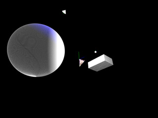
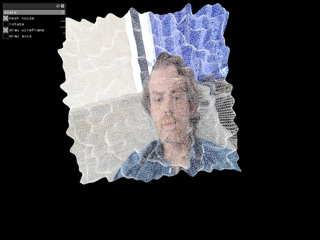
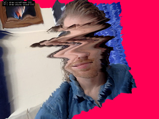
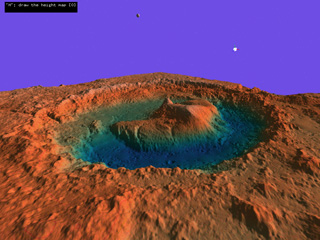

# Week 10 - 3D and Image Processing

## Homework

* **Reading:** 

    + **[Preliminaries to Image Processing](http://openframeworks.cc/ofBook/chapters/image_processing_computer_vision.html#preliminariestoimageprocessing)** section of **ofBook**  
    explains how pixels are stored in memory & shows how to access and manipulate them

* **Code sketch - choose one (or combine them)**:

    + **Glitchy**  
    Load an image or video (e.g. `ofImage`, `ofVideoGrabber`, etc.) and alter it through code!  You can manipulate the colors, warp the shape using `ofMesh`, or experiment with your own methods.
      
    + **3D World**  
    Create a 3D scene using `ofEasyCam`, and place objects around your space.  
    You can use primitive 3D shapes like `ofBoxPrimitive`, or use `ofMesh`.  
    Animate your world with motion and color (and lighting if you wish).
    
    If you wish to instead work on your final project, e-mail me.

## Example Code

* **LightsShapes** (*based on in class example*)  
  Create simple shapes and light them   
     
  
* **MeshWebcam** (*based on in class example*)  
  Warp a mesh based on webcam input  
  Also shows how to use `ofxGui` addon    
  
  
* **3DSlitScan**  
  Similar to `MeshWebcam` but uses slit-scan from webcam  
  
  
* **Terrain**  
  Build a terrain based on a "height map" image  
  Apply a painted texture and accurate lighting (using normals)  
  
  
* **Tyler TO-DO:**  
  + 3D Particles
  + `ofPixels` example


## Quick Review

### Using images

We can load images or video from many sources into openFrameworks... 

Images:

```c++
ofImage image;
image.load("image.jpg");  // or image.png, etc.
```

Video files or Webcam:

```c++
ofVideoGrabber camera;  // webcam source
ofVideoPlayer video;    // video file source

void ofApp::setup() {

    // start a webcam
    camera.listDevices();       // prints your available cameras to console
    camera.setup(640, 480);     // or camera.setup(1, 640,480) for camera #1
    
    // or load a video
    video.load("video.mp4");    
    video.play();               // start the video
}

void ofApp::update() {

    // update the video sources every frame
    camera.update();
    video.update();
}   
```

Once we've loaded the image or video into our application, we can:

+ access the pixels (to analyze or alter them)
+ draw the image in 2D or 3D

We use the graphics card when we **draw** an image, and in this case we call the image a **texture**.  
  
The `ofImage` class contains both an `ofPixels` component for pixel manipulation and an `ofTexture` component for drawing on screen:

```c++
ofImage image;
image.load("image.jpg");

// you can do this:
// ofColor color = image.getColorAt(0,0);      // access image pixel
// image.draw();                               // draw image on screen

// or access the image pixels and texture manually:

ofPixels pixels = image.getPixels();        // access the image's pixels
ofColor color   = pixels.getColorAt(0,0);   // access a single pixel

ofTexture texture = image.getTexture();     // access the drawable texture
texture.draw();                             // draw the image texture

```


### Meshes (`ofMesh`) - the building block of 3D

A 3D mesh is:

+ **vertices**: a bunch of points in 3D space
+ **indices**: a list of connections between the points to form triangles (or polygons)

In openFrameworks we often use the `ofMesh` class to represent a 3D triangle mesh.

`ofMesh` contains a bunch of data - most importantly, our vertices and indices.  

There are also additional (optional) data sets like texture coordinates, colors, and normals.

```c++
ofMesh mesh;

// add 3 vertices
mesh.addVertex( ofVec3f(0,0,0) );       // vertex index 0
mesh.addVertex( ofVec3f(100,0,0) );     // vertex index 1
mesh.addVertex( ofVec3f(0,-100,0) );    // vertex index 3

// add 3 indices to our indices list to form a triangle:
mesh.addIndex(0);
mesh.addIndex(1);
mesh.addIndex(2);

// add color tint to our vertices
mesh.addColor( ofColor::red );      // vertex 0 will be red
mesh.addColor( ofColor::green);     // vertex 1 will be green
mesh.addColor( ofColor::blue);      // vertex 2 will be blue

// add texture coordinates per vertices
// this is how we will map an image texture to our mesh
mesh.addTexCoord( ofVec2f(0,0) );       // image(0,0) at vertex index 0
mesh.addTexCoord( ofVec2f(640,0) );     // image(640,0) at vertex index 1
mesh.addTexCoord( ofVec2f(0,480) );     // image(0,480) at vertex index 2

// for working with normals, see Week10/Terrain example...

```


